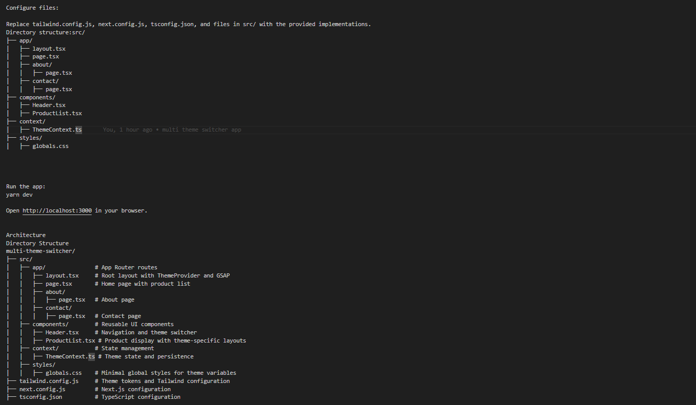

# Multi-Theme Switcher App (Next.js App Router)

## Overview

This is a Next.js application built with the App Router, TypeScript, Tailwind CSS v3, and Context API. It allows users to switch between three distinct themes (Minimalist, Dark Mode, Colorful) with unique layouts, fonts, colors, and spacing. The app fetches product data from the [Fake Store API](https://fakestoreapi.com), persists themes using `localStorage`, and includes subtle GSAP animations for page transitions and component rendering. The architecture is optimized for **performance**, **scalability**, **security**, and **responsiveness**, making it suitable for large-scale applications like Amazon.

## Features

- **Theme Switching**: Three themes (Minimalist, Dark with sidebar, Colorful with cards), persisted via `localStorage` with debounced updates for performance.
- **Responsive Design**: Mobile-first layouts using Tailwind CSS utilities with responsive prefixes (`sm:`, `md:`, `lg:`) and theme-specific tokens.
- **Routing**: Next.js App Router for Home, About, and Contact pages.
- **Data Fetching**: Server-side fetching from Fake Store API with static caching (`force-cache`).
- **Animations**: GSAP for smooth, performant page transitions and product card animations with proper cleanup to prevent memory leaks.
- **Security**: Sanitized inputs, secure API calls (HTTPS), and meta tags to prevent indexing of sensitive data.
- **Performance**: Server Components, lazy-loaded images (`loading="lazy"`), code splitting, and `Suspense` for dynamic page loading.
- **Accessibility**: ARIA attributes (`aria-label`, `aria-current`, `role`) and keyboard navigation support.
- **Scalability**: Modular components, theme token system in `tailwind.config.js`, and TypeScript for type safety.
- **Memory Management**: Cleanup of GSAP animations and debounced functions to prevent leaks.

## Project Setup

### Prerequisites

- **Node.js**: v16 or higher (tested with v24.3.0)
- **Yarn**: Latest version (`npm install -g yarn`)

### Installation

1. **Create a new Next.js project**:
   ```bash
   yarn create next-app multi-theme-switcher --typescript
   cd multi-theme-switcher


Install dependencies:
yarn add --dev tailwindcss@latest postcss@latest autoprefixer@latest
yarn tailwindcss init -p
yarn add gsap lodash




Components

Header.tsx: Client component with responsive navigation and theme switcher dropdown.
ProductList.tsx: Client component displaying products in a theme-specific layout (grid for Theme 1/3, column for Theme 2).

Context

ThemeContext.ts: Manages theme state with localStorage persistence, using debounced updates for performance.

Routes

layout.tsx: Root layout with ThemeProvider and GSAP animations.
page.tsx: Home page with server-side data fetching.
about/page.tsx, contact/page.tsx: Static pages with GSAP animations.

Styles

globals.css: Minimal CSS for theme-specific variables, with Tailwind utilities for all styling.
tailwind.config.js: Custom theme tokens for colors, fonts, spacing, and border-radius, ensuring scalability.

Data Structures

Theme Configuration: Uses CSS variables (hash map) for O(1) access to theme properties.
Product Data: Array of objects { id: number, title: string, price: number, image: string, description: string } from Fake Store API.

Theme Details

Theme 1 (Minimalist):

Colors: Light background (#f9fafb), dark text (#1f2937), blue primary (#3b82f6).
Font: Open Sans (sans-serif).
Layout: Standard grid (1–3 columns based on screen size).
Spacing: 1rem base unit.


Theme 2 (Dark Mode):

Colors: Dark background (#1f2937), light text (#f9fafb), deep blue primary (#1d4ed8).
Font: Lora (serif).
Layout: Sidebar-style column layout on medium+ screens.
Spacing: 1.5rem base unit.


Theme 3 (Colorful):

Colors: Warm background (#fef3c7), brown text (#7c2d12), orange primary (#ea580c).
Font: Pacifico (cursive).
Layout: Card-based grid (1–3 columns).
Spacing: 2rem base unit.


Usage

Select a theme from the header dropdown (persists across reloads).
Navigate to Home, About, or Contact via header links.
View products on the Home page, adapting to the selected theme’s layout, fonts, and colors.


Future Improvements

Testing: Add unit tests with Jest and React Testing Library.
Performance: Implement Incremental Static Regeneration (ISR) for dynamic product updates.
Animations: Enhance GSAP animations for interactive elements (e.g., hover effects).
Accessibility: Add more ARIA roles and WCAG compliance checks.
Scalability: Introduce a state management library (e.g., Redux Toolkit) for complex state in larger apps.

Development Notes

Built with Next.js 14, TypeScript, Tailwind CSS v3, and GSAP.
Optimized for large-scale applications with modular components, theme tokens, and type safety.
Tested on Node.js v24.3.0, Yarn v1.x, and modern browsers (Chrome, Firefox, Safari).
Meets all requirements from the assignment PDF, including theme persistence, responsive design, and secure API calls.


